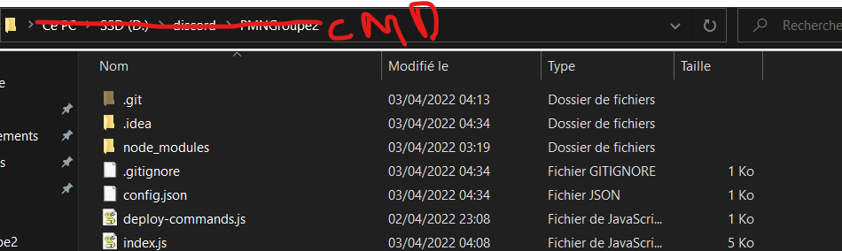

# ScrumAcolyte

- What is ScrumAcolyte are you asking?
ScrumAcolyte is discord bot to help your team collaborate easily, help with check-ins, motivations, dailyScrum preparation etc...
- Still in development but... hey ! Stay tuned, the bot is growing fast!


# Requirements:

- Remember that the bot need ```config.json``` file to work, a template of config.json is available in the git.
- The bot is made in JavaScript, don't forget to install nodeJS before using it.
- We used NPM, CRON & MYSQL package to make the bot, dont forget to install these packages or the bot wont work at all.

# To setup the project :

- First, you need to open cmd in the explorer like this (little trick I've learned from a friend but shhh, don't tell everyone about that !) : 
- Inside the CMD, execute : ```npm install discord.js``` and when it is finished, execute : ```npm install mysql```.

# To initialize the bot and its command

- Execute in the cmd : ```node deploy_commands.js``` to initialize its command on your test server
- once its done, execute : ```node index.js``` and your bot is online and ready to work!
